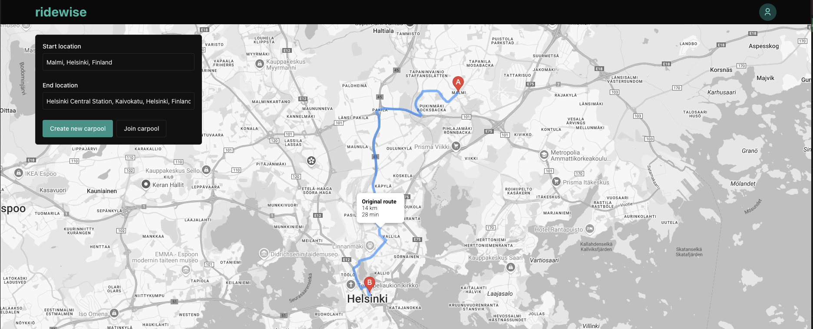
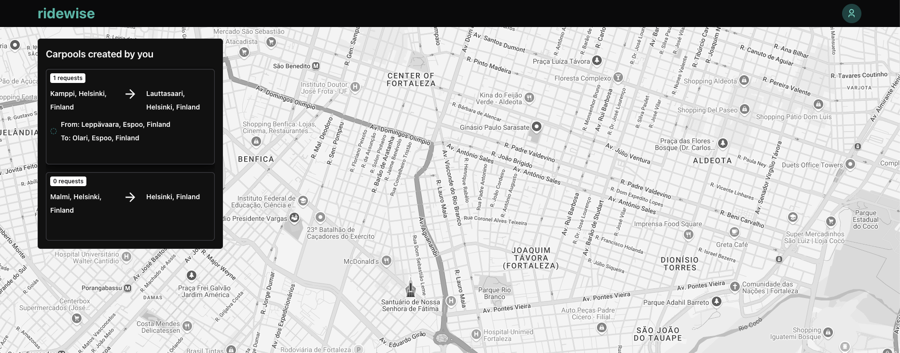
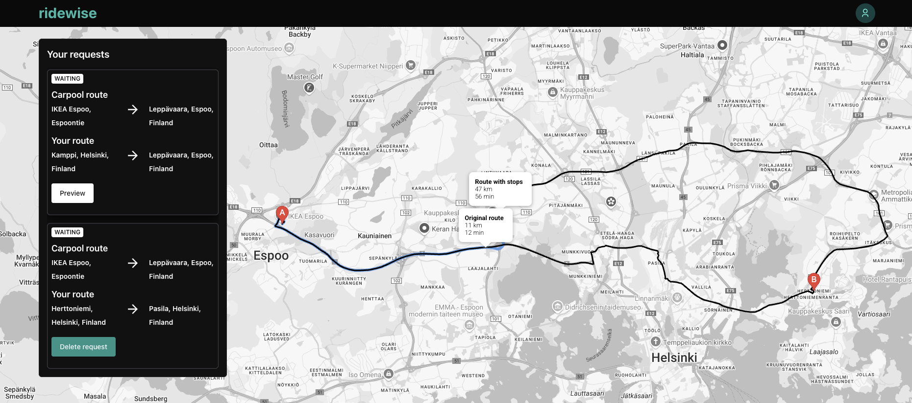
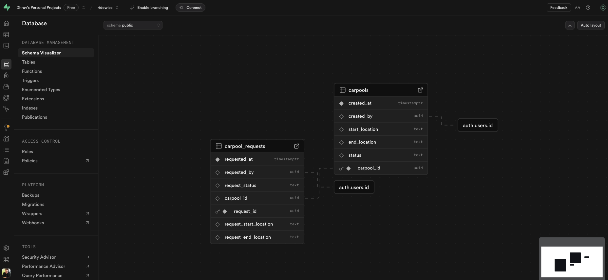
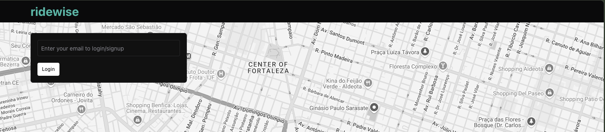
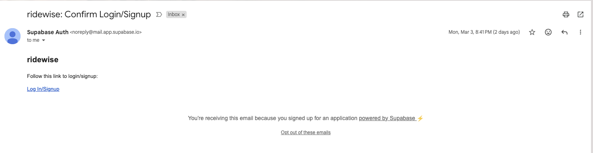

# ridewise

## Idea

Next JS 15 is quite a hot topic on the frontend industry. What better way to do hands on than building a project. I had this ridewise project in past which using React+MUI and was pretty simple. I felt like upgrading it to Next JS 15 to understand the new architecture and at the same time club it with Google's Routing API to build a good solution.

ridewise is a simple web app that lets users create and join a carpool.

> The app is not deployed to Vercel as the Google Maps API incurs cost and I don't want to be surprised with unexpected charges at the end of month.
> Moreover Google API's dont allow you to put some capping based on the budget.

## Tech Stack used

- **Frontend:** NextJS 15 + React19 + TypeScipt, [Chakra UI v3](https://chakra-ui.com/)
- **Backend:** [Supabase](https://supabase.com/) with Postgres(DB functions, Triggers)
- **Other:** Zustand for Global state mgmnt, React Hook Form+Zod, [Google Maps Routing API](https://developers.google.com/maps/documentation/routes)

# Why Supabase

I first tried with Google Firestore, its a good solution but the since its a No-SQL approach, creating references, performing joins was quite difficult. With Supabase its a Postgres DB, so things are sorted.

## Screenshots

### Crate a carpool

The person searches the start and end location and either creates a carpool or searches some existing carpools.

### Crate a carpool

Check the carpool requests submitted by you.

### Check the carpools created by you

Check the carpool requests submitted by you.

### Supabase Dashboard

### Magic Link Email

The Magic link is sent to the user's email address. Clicking on the links signs the user in. No need to remember passwords anymore.

## Future Improvements

### Limit the amount of creations

In order to avoid spam, the user would be allowed to create a new carpool every 30min. We already have the Postgres trigger which updates last creation time of user in the Users table. The frontend side logic needs to be created.

### Find only optimized carpools for user

Currently when returning the available carpool options or carpool requests the system does not take into account if the carpool will fall within a sepcified route. All it shows is distance and extra time on the map and it's up to the person to decide whether they want to take that carpool. In future the isLocationOnEdge helper of Google Maps API can be used to acheieve the same.

## Deploy on Vercel

The easiest way to deploy your Next.js app is to use the [Vercel Platform](https://vercel.com/new?utm_medium=default-template&filter=next.js&utm_source=create-next-app&utm_campaign=create-next-app-readme) from the creators of Next.js.

Check out our [Next.js deployment documentation](https://nextjs.org/docs/app/building-your-application/deploying) for more details.
