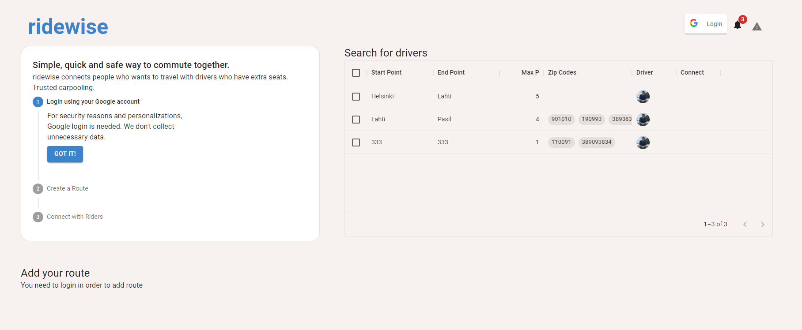
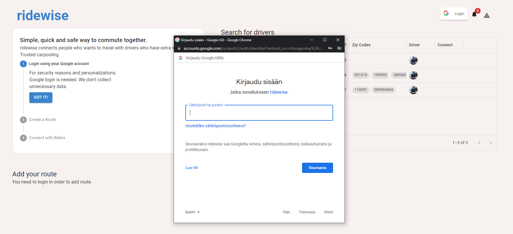
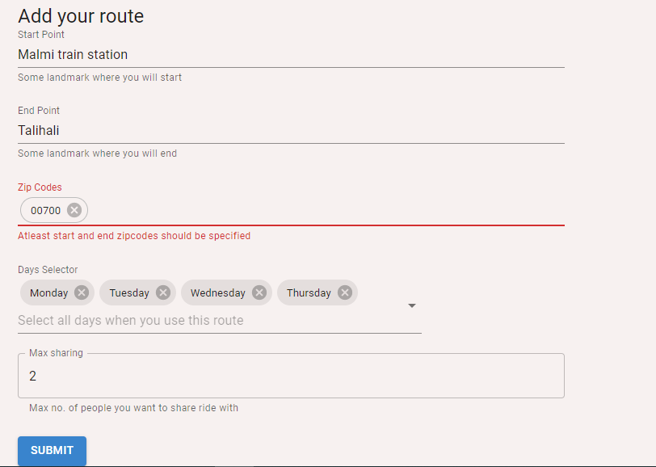
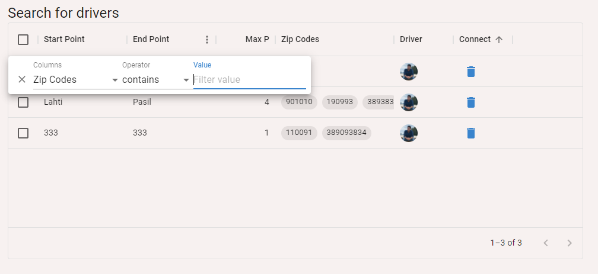
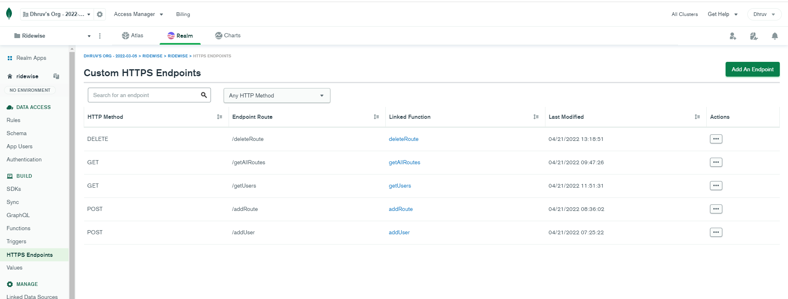
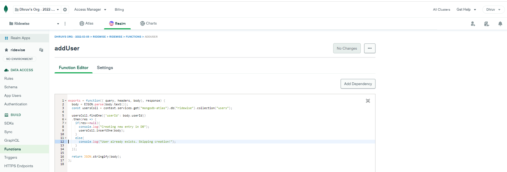
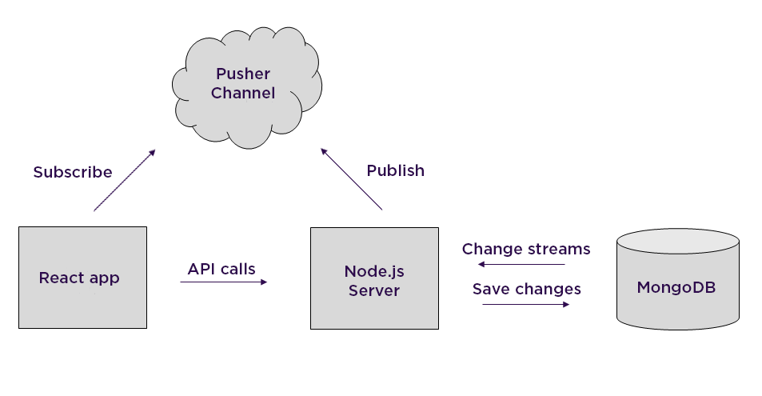
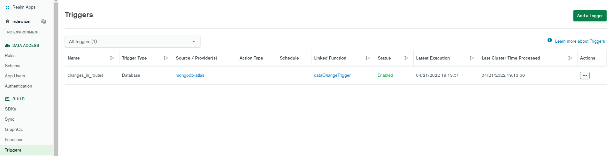
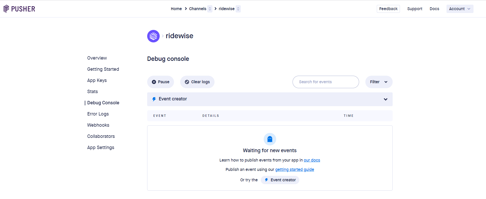

<h2>Checkout the app hosted here https://ridewise-xstzz.mongodbstitch.com/</h2>
 
<h2>React MUI components and Grid Layout</h2>

 
<h2>Google Login supported</h2>

 
<h2>Formik forms and Yup validations</h2>

 
<h2>MUI DataGrid Component with sorting and filtering. Real time data changes</h2>

 
<h2>MongoDB Atlas for Backend as a service: Custom HTTPS endpoints</h2>

 
<h2>Custom functions in MongoDB Realm</h2>

 
<h2>Pusher for reciveing Real time data change events</h2>

 
<h2>Mongo Realm Trigger for Real time data change events</h2>

 
<h2>Pusher Console</h2>

Create React App
=================================
npx create-react-app ridewise

Start app
===============================
npm start

Git steps
===============================
git init -b main git remote add origin https://github.com/pdhruv93/ridewise.git git add . && git commit -m "initial commit" && git push git push origin main

User pusher
========================
https://pusher.com/tutorials/mongodb-change-streams/
https://www.youtube.com/watch?v=gMvlI7OU-yM

React App Mongo Realm Hosting
====================================
ridewise-xstzz.mongodbstitch.com